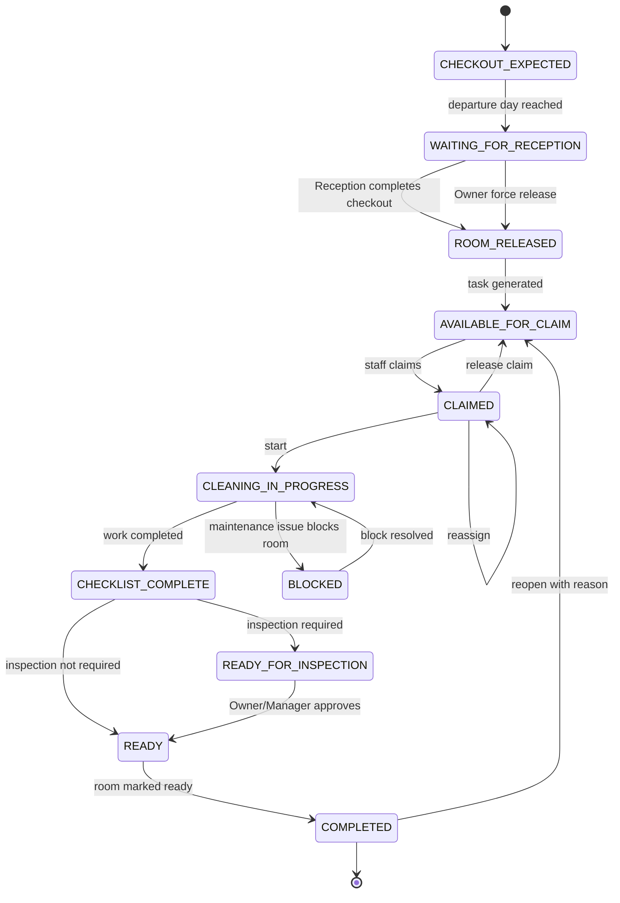
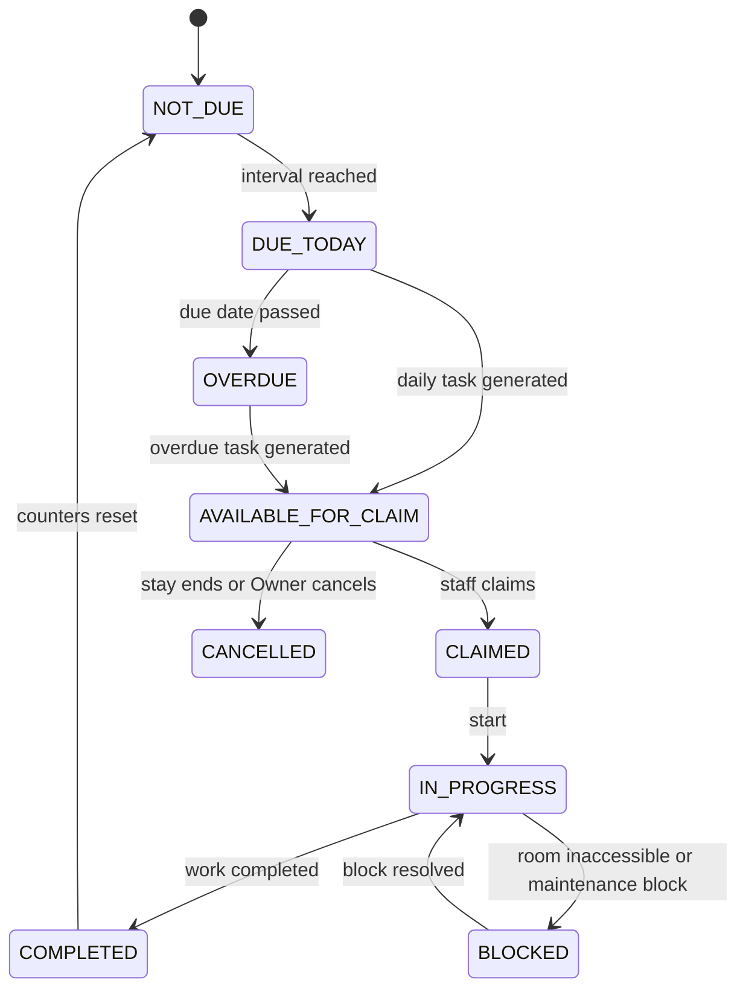
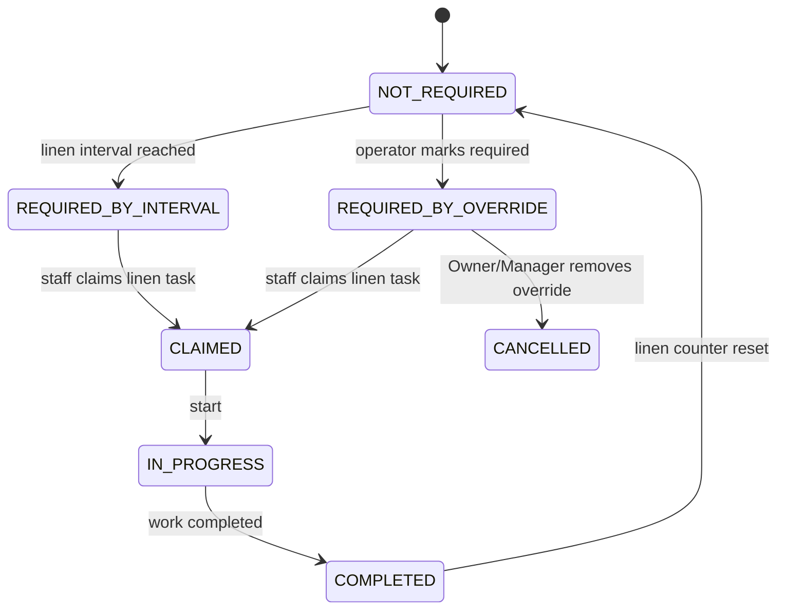
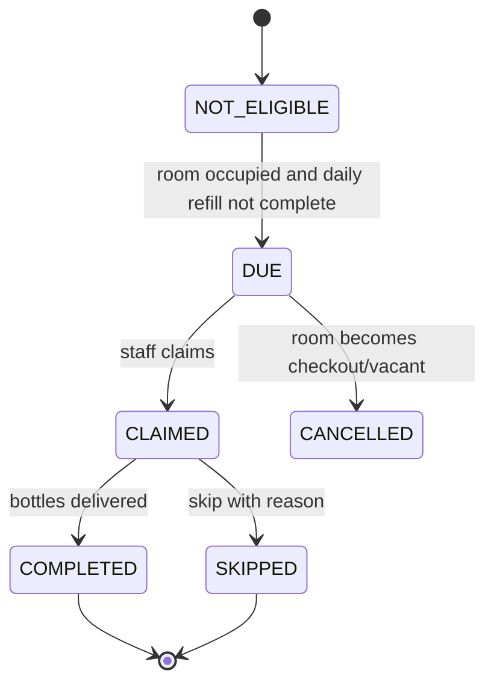
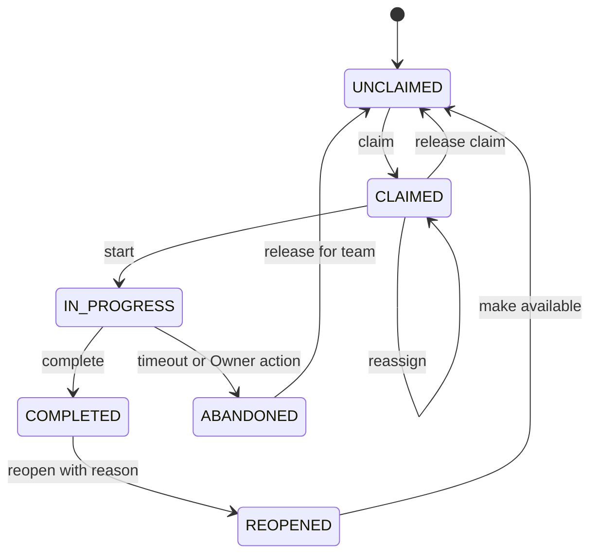
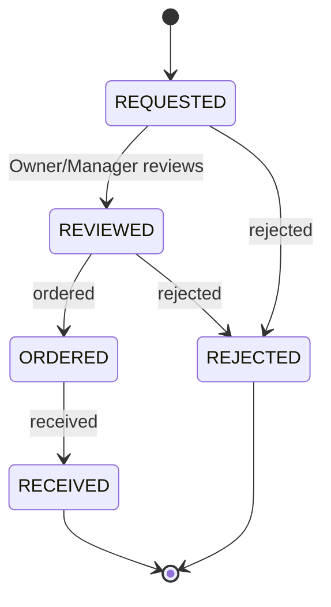
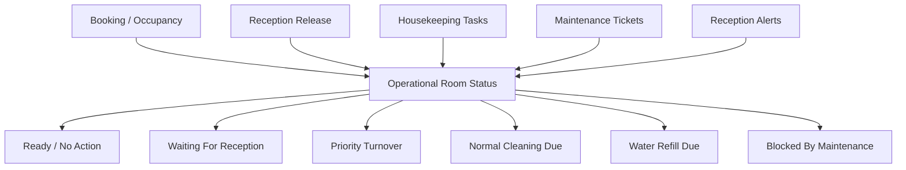

# Vanara Central — Housekeeping Workspace Architecture

Status: architecture definition before implementation  
Scope: Housekeeping workspace only  
Repository source of truth: current Vanara Central codebase and `documentations/`  
Do not treat this document as an implementation diff. It defines the target architecture for future sprints.

## 1. Purpose

This document defines the executable architecture for the future Housekeeping workspace in Vanara Central.

It is intended to be used by a fresh Codex session to implement Housekeeping sprint by sprint without relying on chat history.

The workspace must support daily resort operations:

- priority turnover after real guest check-out;
- standard occupied-room cleaning every 3 days;
- separate linen-change management;
- daily water refill;
- staff task claiming and completion;
- maintenance issue handoff;
- small supply/procurement requests;
- Reception dependency visibility;
- future English and Thai translation.

This document does not implement code, migrations, APIs, CSS, or deployment.

## 2. Product Philosophy

Vanara Central is not a traditional hotel management system.

Housekeeping must be:

- mobile-first;
- extremely fast;
- simple for non-technical Thai staff;
- operational;
- card-based;
- low-tap;
- visually calm;
- premium;
- compatible with future Thai/English translation;
- independent from enterprise table-based UX.

The current Housekeeping page in the repository is not an approved UX reference. It is a useful technical baseline only.

The final visual design and Motion System refinement will happen later. This architecture defines behavior, information architecture, state, permissions, contracts, and data boundaries.

## 3. Current Repository Baseline

### 3.1 Existing Roles

The repository already supports these roles:

- `Owner`
- `Manager`
- `Reception`
- `Housekeeping`
- `Maintenance`
- `Operations`

The role model is defined by the auth foundation migration and module permission tables.

### 3.2 Existing Operational Dimensions

The operational documentation already separates room state into independent dimensions:

- occupancy state;
- cleaning state;
- technical state.

These dimensions must remain separate. A room can be occupied and due for normal cleaning. A room can be vacant and blocked by maintenance. A room can be released by Reception but still unclaimed by Housekeeping.

### 3.3 Existing Housekeeping Implementation

Current backend service:

- `server/src/services/housekeeping-overview.service.ts`

Current frontend page and client:

- `src/pages/HousekeepingPage.tsx`
- `src/services/housekeeping.service.ts`
- `src/types/housekeeping.ts`

Current Housekeeping API endpoints:

- `GET /api/housekeeping`
- `GET /api/housekeeping/assignable-users`
- `PATCH /api/housekeeping/rooms/:id`
- `PATCH /api/housekeeping/rooms/:id/assignment`
- `PATCH /api/housekeeping/rooms/:id/checklist`

Current Housekeeping database table:

- `housekeeping`

Current workflow status values:

- `Dirty`
- `Cleaning`
- `Ready`

Current operational groups:

- `clean-first`
- `clean-today`
- `ready`
- `occupied`

Legacy checklist fields exist in the old implementation but are not product-facing in Housekeeping V2:

- no operational checkbox completion is required;
- Cleaning and Full Cleaning may show informational help only;
- completion equals trusted work completion.

### 3.4 Existing Reception Dependencies

Reception already persists local operational stay state in `reception_stays`, including:

- `guest_arrived`
- `passport_collected`
- `deposit_collected`
- `welcome_completed`
- `keys_delivered`
- `guest_left`
- `keys_returned`
- `deposit_returned`
- `room_released`
- completion timestamps

Reception already creates room alerts in `reception_room_alerts`, currently for:

- `passport_missing`
- `deposit_pending`

Reception check-out completion sets:

- `guest_left = 1`
- `keys_returned = 1`
- `deposit_returned`
- `room_released = 1`

Housekeeping must consume Reception state. It must not own Reception workflows.

### 3.5 Existing Maintenance Boundary

The repository already has a Maintenance workspace foundation:

- `maintenance_tickets`
- `maintenance_ticket_notes`
- `maintenance_ticket_photos`
- `maintenance_ticket_events`

Maintenance supports:

- room-linked tickets;
- priority;
- category;
- status transitions;
- assignment;
- out-of-service flag;
- internal and external assignees.

Housekeeping should create or link Maintenance issues. It must not redesign Maintenance.

### 3.6 Existing Procurement Boundary

The repository already has a Procurement foundation:

- `procurement_suppliers`
- `procurement_items`
- `procurement_requests`
- `procurement_request_items`

Procurement supports:

- item requests;
- quantities;
- requester;
- status;
- review/order/receive/reject lifecycle.

Housekeeping should expose a small request widget. It must not become a purchasing system.

## 4. Current-Code Conflicts With Target Architecture

These conflicts must be resolved during implementation sprints.

| Area | Current Code | Target Architecture | Conflict |
|---|---|---|---|
| Home UX | Every room card renders assignment selector, checklist, and actions | Home uses concise operational task cards; Room Workspace owns full room browsing | Current page is too dense and not approved |
| Categories | `clean-first`, `clean-today`, `ready`, `occupied` | Priority, Normal, and Water actionable lists only | Current groups do not match target operations |
| Reception release | `checkoutSource()` hardcodes missing Reception flag and uses 14:30 fallback | Turnover cannot begin until Reception releases room | Current fallback can expose rooms before real release |
| Status model | `Dirty`, `Cleaning`, `Ready` | Task-specific states and claim lifecycle | Current enum is too coarse |
| Checklist model | One universal checklist | No mandatory detailed operational checklist; optional static intervention help only | Current checklist is not part of the approved product flow |
| Data model | One `housekeeping` row per room/work_date | Multiple task types per room/day with independent state | Current table is insufficient |
| Assignment | Assignment belongs to room/day row | Assignment belongs to operational task | Current assignment is not task-specific |
| Water refill | Not modeled | Daily occupied-room task | Missing domain |
| Linen counters | Not modeled | Independent linen interval and manual override | Missing domain |
| Normal cleaning counters | Not modeled | Every 3 occupied days by default | Missing domain |
| On-demand cleaning | Not modeled | Room Workspace can create extra task even if room is clean; Housekeeping Workspace only displays existing active work | Missing domain |
| Audit | Limited timestamps | Per-transition audit events | Missing for accountability |
| Alerts | Reception alerts exist only for passport/deposit | Extensible operational alert contract | Partial |
| Concurrency | No task version/idempotency | Optimistic locking or equivalent | Missing |
| Procurement | Existing API is generic procurement | Housekeeping needs small room/task-aware widget | Partial |

## 5. Target Page Hierarchy

The Housekeeping home workspace must follow this hierarchy:

1. Compact Priority, Normal, and Water summary cards at the top.
2. One expanded actionable list only after the user taps a summary card.
3. Task controls shown progressively from server-derived capabilities.
4. Room identity opens the separate Room Workspace.

The home must not render every list by default, clean rooms, no-action rooms, or the full operational controls of every room.

Rooms initially do not appear. Only the three summary cards appear.

Opening a room identity reveals the complete Room Workspace. Opening a task-specific action surface remains separate from room browsing.

## 6. Top Summary

### 6.1 Required Counters

The current-day summary must include at least:

| Counter | Meaning | Calculation | Source |
|---|---|---|---|
| Awaiting Reception Release | Check-outs expected or due, not yet released by Reception | Turnover candidates where `room_released != 1` | `bookings`, `reception_stays` |
| Priority Turnovers | Released rooms requiring turnover before next arrival | Turnover tasks in `AVAILABLE_FOR_CLAIM`, `CLAIMED`, `CLEANING_IN_PROGRESS`, `CHECKLIST_COMPLETE`, or inspection state | Housekeeping tasks plus Reception release |
| Normal Cleaning Due | Occupied rooms due for standard cleaning today | Occupied stay where `next_standard_cleaning_due <= today` and no completed standard cleaning today | Housekeeping counters/tasks |
| Water Refill Due | Occupied rooms due for daily refill | Occupied rooms without completed refill today | Housekeeping refill tasks |
| Tasks Claimed | Tasks assigned but not complete | Task has assignee and active status | Housekeeping tasks |
| Tasks In Progress | Active tasks marked in progress | Task state `IN_PROGRESS` or equivalent | Housekeeping tasks |
| Blocked Rooms | Rooms blocked by Reception release or maintenance | Waiting release or maintenance out-of-service | Reception and Maintenance |
| Completed Today | Tasks completed today | `completed_at` on current date | Housekeeping tasks |
| Procurement Attention | Housekeeping supply requests requiring action | Requested or urgent requests not resolved | Procurement requests |

### 6.2 Update Behavior

The summary updates when:

- the page loads;
- the selected date changes, if date selection exists;
- a task is claimed, started, completed, reopened, reassigned, or cancelled;
- Reception completes check-out and releases a room;
- Maintenance marks a room out of service or resolves a blocking ticket;
- Procurement request status changes;
- the user manually refreshes.

The MVP can use request/response refresh. Realtime push is out of scope.

### 6.3 Permission Visibility

| Role | Summary Visibility |
|---|---|
| Owner | Full summary, including procurement attention and force-release counts |
| Manager | Full operational summary except Owner-only force-release controls unless explicitly granted |
| Housekeeping | Operational task counters relevant to work execution |
| Reception | Read-only visibility into release-dependent and housekeeping readiness states if module access permits |
| Maintenance | Read-only visibility only where maintenance integration requires it |
| Operations | Same as configured module permissions |

### 6.4 Empty States

Empty states must be operational and concise:

- No priority work.
- No normal cleaning work.
- No water refills.

Empty states must not imply that the whole workspace is inactive if another section has work.

## 7. Primary Operational Sections

Actionable section order is fixed:

1. Priority
2. Normal
3. Water

Ready / No Action Required and Procurement are not user-facing Housekeeping Workspace lists. Legacy ready/procurement data may exist outside this read model, but this workspace renders only active housekeeping work.

### 7.1 Priority Turnover

Purpose: rooms that need turnover because a guest is checking out and the room must be prepared for a future or same-day arrival.

Entry:

- booking has departure date today or selected operational date;
- booking is confirmed or operationally active;
- Reception state exists or is created on demand;
- room is not already completed for turnover today.

Substates:

- checkout expected;
- waiting for Reception;
- room released;
- available for claim;
- claimed;
- cleaning in progress;
- intervention complete;
- ready for inspection or ready;
- completed.

Exit:

- turnover completed;
- checkout cancelled;
- booking status changed so no checkout is required;
- room becomes maintenance-blocked and task is paused or blocked;
- Owner cancels task with reason.

Blocked state:

- shown when Reception has not released the room;
- no Housekeeping claim/start/complete action allowed;
- card may show guest, expected checkout, next arrival, alerts, and reason.

### 7.2 Normal Cleaning

Purpose: scheduled cleaning for occupied rooms.

Entry:

- room is occupied;
- guest has arrived or stay is in-house;
- room is not departing today;
- standard cleaning due date is today or overdue;
- no completed standard cleaning task exists for current due cycle.

Default frequency:

- every 3 days.

Exit:

- standard cleaning completed;
- task cancelled because room becomes checkout/turnover;
- room becomes vacant;
- task skipped with approved reason, if this action is implemented.

### 7.3 Water Refill

Purpose: daily water delivery for occupied rooms.

Entry:

- room is occupied;
- not a check-in room that has not yet arrived;
- not a check-out room;
- not vacant;
- not awaiting checkout release;
- refill not completed today.

Exit:

- refill completed;
- refill skipped with reason;
- room becomes checkout/vacant;
- room becomes maintenance-blocked and refill cannot be performed.

MVP quantities are hardcoded by accommodation type:

- Bungalow: 2 bottles.
- Yurt/Tent: 2 bottles.
- Villa: 4 bottles.

Guest count is informational only and must not be used for water quantity, water eligibility, cleaning generation, linen, priority, procurement, or any Housekeeping decision.

## 8. Turnover Workflow

### 8.1 Required Rule

A turnover starts from an actual guest check-out.

Housekeeping must not begin turnover until Reception releases the room.

Required sequence:



### 8.2 Reception Dependency

Housekeeping consumes:

- checkout date;
- guest identity;
- keys returned state;
- guest left state;
- room released state;
- next check-in;
- unresolved Reception alerts.

The authoritative release gate is:

- `reception_stays.room_released = 1`

If a booking lacks a `reception_stays` row, the system should create or infer a local operational shell only through a backend service, not in the frontend.

The existing 14:30 automatic fallback is not acceptable as the long-term source of truth for the approved workflow.

### 8.3 Waiting For Reception

While waiting, Housekeeping can see:

- room name;
- departing guest name;
- expected checkout date;
- next check-in date/time when available;
- OTA/source;
- current Reception release status;
- unresolved passport/deposit alerts if relevant;
- maintenance block if present.

Housekeeping cannot:

- claim the turnover task;
- start cleaning;
- complete the task;
- mark ready.

### 8.4 Force Room Released

Owner-only action.

Available when:

- departure is today or overdue;
- Reception has not released the room;
- Owner has reason to override the normal Reception gate.

Required confirmation:

- explicit confirm button;
- mandatory reason;
- warning that the room may still contain guest belongings or keys may not be returned.

Result:

- room becomes released for Housekeeping;
- turnover task becomes available for claim;
- audit event records user, timestamp, reason, original state, resulting state.

Risks:

- incorrect release can start cleaning before guest departure;
- guest belongings may be disturbed;
- keys/deposit workflows can diverge from Reception.

Mitigation:

- Owner-only;
- mandatory reason;
- visible audit trail;
- no bulk force-release.

### 8.5 Completion

Completion requires:

- task assigned to current user or Owner override;
- operator marks the task complete under the trust model;
- no blocking maintenance issue marked out of service;
- inspection state satisfied if inspection is enabled;
- completion timestamp recorded;
- audit event inserted.

### 8.6 Reopening

Reopening requires:

- Owner or Manager permission by default;
- mandatory reason;
- completed task moves back to available or claimed state depending on assignee decision;
- audit event records reason.

### 8.7 Cancellation

Cancellation applies when:

- booking is cancelled;
- checkout is no longer due;
- room is reassigned in Beds24;
- duplicate task was generated incorrectly.

Cancellation requires:

- backend validation;
- reason or source;
- audit event;
- no deletion of history.

## 9. Normal Cleaning

Normal cleaning applies to occupied rooms.

Default frequency:

- every 3 days.

Standard cleaning and linen change are independent concepts.

### 9.1 Cleaning

Product meaning:

- general room cleaning;
- amenities check.

Fields required:

- `last_standard_cleaning_at`
- `last_standard_cleaning_task_id`
- `next_standard_cleaning_due_date`
- `standard_cleaning_interval_days`
- `standard_cleaning_due_reason`

Reset conditions:

- completing a standard cleaning task resets last standard cleaning date;
- completing standard cleaning plus linen also resets standard cleaning date;
- turnover completion resets standard cleaning baseline for the new stay.

Carry-over priority:

- active Standard Cleaning task `operational_date < today`
- visible in Priority section with the same task id.
- original operational dates are not rewritten.

### 9.2 Full Cleaning

Product meaning:

- general room cleaning;
- linen change;
- amenities check.

Linen must not automatically be required before the configured interval.

Fields required:

- `last_linen_change_at`
- `last_linen_change_task_id`
- `next_linen_change_due_date`
- `linen_interval_days`
- `linen_required_override`
- `linen_override_reason`

Manual override:

- operator can select `Linen Change Required`;
- completion of linen task resets only linen counters;
- if standard cleaning is also performed, standard cleaning counters reset too.

Permissions:

- Housekeeping may mark linen required during cleaning;
- Owner/Manager may override schedule/cancel erroneous linen requirement;
- all overrides must be audited.

### 9.3 Normal Cleaning State Machine



### 9.4 Linen State Machine



## 10. On-Demand Cleaning

On-demand cleaning supports guest-requested cleaning through Room Workspace, a physical room sign, or future source.

Room Workspace must be able to open a cleaning task even when the room is currently marked clean. Housekeeping Workspace must not create On-Demand Cleaning; it only displays an active on-demand task in the Normal list after another authorized source creates it.

### 10.1 Creation

Allowed sources:

- Room Workspace manual entry;
- Reception manual entry, if later authorized;
- future room-sign integration;
- future guest request source.

Required fields:

- room/unit;
- source;
- requested by;
- requested at;
- task type;
- priority;
- duplicate key.

Optional fields:

- note.

### 10.2 Duplicate Prevention

Do not create another active on-demand task when an active on-demand task already exists for the same room and source on the same day.

Allowed duplicate exception:

- Owner/Manager creates explicit second task with reason.

### 10.3 Completion Options

When completing an on-demand task, operator chooses:

- Cleaning;
- Full Cleaning.

Counter updates:

- Cleaning resets only cleaning counters;
- Full Cleaning resets both cleaning and linen counters.

### 10.4 Audit

Audit events required:

- created;
- claimed;
- started;
- completed;
- cancelled;
- reassigned;
- linen override selected;
- duplicate override.

## 11. Water Refill

Water refill is daily.

Only occupied rooms are eligible.

Exclude:

- check-in rooms not yet occupied;
- check-out rooms;
- vacant rooms;
- rooms awaiting checkout release.

### 11.1 Default Quantities

| Room Type | Bottles |
|---|---:|
| Bungalow | 2 |
| Villa | 4 |
| Tent | 2 |

Repository note: current unit names include Bungalow, Villa, and Yurt. Product Owner must confirm whether `Yurt` maps to the `Tent` quantity rule.

### 11.2 Due Generation

A water refill task is due when:

- selected operational date is today or generated date;
- room is occupied;
- no refill completion exists for that room/date;
- room is not checking out that date;
- guest has arrived for the stay;
- room is not awaiting checkout release.

### 11.3 Completion

Completion requires:

- task claimed by current operator or Owner;
- delivered quantity confirmed;
- optional quantity override reason if delivered quantity differs from default;
- timestamp and audit event.

### 11.4 Skip

Skip is allowed when:

- guest refuses;
- do-not-disturb;
- room inaccessible;
- maintenance block;
- operational exception.

Skip requires:

- reason;
- timestamp;
- audit event.

### 11.5 Water Refill State Machine



## 12. Claim And Ownership

Each operational task can be claimed by only one person.

Only:

- assigned operator;
- Owner;

may complete or close the task.

Manager may reassign by default, unless Product Owner restricts this to Owner.

### 12.1 Claim Lifecycle



### 12.2 Concurrency Protection

Required:

- task has `version` integer or `updated_at` compare-and-set;
- claim requests include expected version;
- backend rejects stale updates with `409 conflict`;
- UI refreshes task after conflict;
- duplicate complete requests are idempotent when using the same idempotency key.

### 12.3 Abandoned Tasks

Abandoned state is optional for MVP.

If supported:

- task can be marked abandoned after configurable inactivity;
- Owner/Manager can release it;
- audit event records reason.

If not supported in MVP:

- omit automated timeout;
- allow manual release/reassign only.

## 13. Compact Room Card

The compact room card is for immediate prioritization only.

It should show:

- room name;
- room type;
- current guest, when relevant;
- stay dates, when relevant;
- check-out time or release state;
- next check-in date/time, when relevant;
- task type;
- priority;
- blocking state;
- assignee;
- overdue state;
- alert count;
- small status indicator.

It must not show:

- assignment selector;
- detailed operational checklist;
- all actions;
- raw database state;
- long notes;
- complete history.

Room identity opens Room Workspace. Task-specific controls may open a Housekeeping task surface only when the server capabilities require a task action.

Fast actions may be allowed only when they are safe:

- Claim;
- Start after claimed;
- Complete work when claimed and allowed by server capabilities.

## 14. Room Detail

Clicking the room identity on a compact row opens the complete Room Workspace.

### 14.1 Required Sections

Room Workspace detail must include:

- room identity;
- current occupancy;
- guest;
- stay;
- check-out;
- next check-in;
- operational photos;
- active task;
- previous relevant cleaning data;
- standard cleaning status;
- linen status;
- water refill status;
- maintenance issues;
- Reception alerts;
- task claim;
- completion controls;
- room notes.

### 14.2 Read-Only Data

Housekeeping sees but does not edit:

- Beds24 booking data;
- guest identity from Reception/Beds24;
- check-in/check-out dates;
- Reception passport/deposit alerts;
- Reception room release state;
- maintenance ticket state unless using maintenance integration;
- room type and unit identity.

### 14.3 Editable Data

Depending on role and task state:

- claim/release task;
- start task;
- operational note;
- attach housekeeping evidence photo where justified;
- mark linen required;
- complete task;
- skip water refill with reason;
- create maintenance issue;
- create procurement request;
- request reopen or reopen with permission.

## 15. Intervention Help

Housekeeping V2 does not require detailed operational checklists.

Vanara trusts trained Housekeeping staff. The software decides:

- where;
- when;
- which intervention level.

The approved intervention types are:

- Cleaning: general room cleaning plus amenities check.
- Full Cleaning: general room cleaning plus linen change plus amenities check.

Tapping Cleaning or Full Cleaning may show a static information sheet. This help is informational only, does not block completion, and is not tracked.

## 16. Reception Dependencies

Housekeeping consumes Reception state but does not own it.

### 16.1 Consumed Reception Data

Required:

- actual check-out;
- room released;
- next check-in;
- check-in time where available;
- guest identity;
- occupancy;
- passport missing alert;
- deposit pending alert;
- future room alerts.

### 16.2 Room Release Event

The canonical release event is:

- Reception completes check-out and sets `room_released = 1`.

Housekeeping must not infer release from time alone.

Time-based fallback may be retained only as an explicit degraded mode if Product Owner approves it.

### 16.3 Extensible Alert Contract

Room cards and details should consume alerts with this shape:

```ts
type OperationalRoomAlert = {
  id: number;
  roomId: number;
  bookingId?: number | string;
  source: "reception" | "housekeeping" | "maintenance" | "procurement" | "system";
  type: string;
  severity: "info" | "warning" | "critical";
  titleKey: string;
  defaultTitle: string;
  messageKey?: string;
  defaultMessage?: string;
  status: "active" | "resolved";
  createdAt: string;
  resolvedAt?: string | null;
};
```

Passport and deposit alerts must be displayable, but Housekeeping must not resolve them unless a later architecture decision explicitly authorizes it.

## 17. Maintenance Integration

Housekeeping may report a room issue.

### 17.1 Issue Creation

Required fields:

- room reference;
- category;
- priority/severity;
- note;
- optional photo;
- whether cleaning can continue;
- whether room must be blocked;
- source task reference;
- reporter.

### 17.2 Maintenance Linkage

Creating an issue from Housekeeping should create a Maintenance ticket using the existing Maintenance service boundary.

If `out_of_service = true`:

- room is blocked;
- active housekeeping task enters blocked state or prevents ready completion;
- room card shows blocking maintenance.

### 17.3 Visibility

Housekeeping detail should show:

- open maintenance ticket count;
- ticket category;
- severity;
- out-of-service state;
- latest status;
- whether cleaning may continue.

Maintenance owns resolution.

## 18. Procurement Widget

Procurement is a small widget near the bottom of Housekeeping.

### 18.1 Purpose

Used when Housekeeping lacks supplies.

Examples:

- detergent;
- towels;
- amenities;
- water;
- trash bags;
- guest room supplies.

### 18.2 Required Fields

- item;
- quantity;
- urgency;
- note;
- requester;
- room reference, optional;
- task reference, optional;
- status;
- created at.

### 18.3 Duplicate Handling

If an active request exists for the same item and urgency:

- show existing request;
- allow adding note or quantity only if current procurement service supports it;
- otherwise create a new request only with explicit reason.

### 18.4 Procurement State Machine



## 19. Room Operational Cleaning State

Room operational cleaning state is derived from independent data.

It must not collapse Reception, Maintenance, and Housekeeping into one string.



Derived display state examples:

- Waiting for Reception
- Available for Turnover
- Cleaning In Progress
- Ready for Inspection
- Ready
- Occupied / Cleaning Due
- Occupied / Water Due
- Blocked by Maintenance

## 20. Database And Domain Model

No migrations are written by this document.

### 20.1 Already Implemented

Reusable entities:

- `users`
- `roles`
- `user_module_permissions`
- `user_action_permissions`
- `units`
- `room_types`
- `bookings`
- `reception_stays`
- `reception_room_alerts`
- `maintenance_tickets`
- `maintenance_ticket_notes`
- `maintenance_ticket_photos`
- `maintenance_ticket_events`
- `procurement_items`
- `procurement_requests`
- `procurement_request_items`
- `housekeeping`

### 20.2 Partially Implemented

The existing `housekeeping` table partially supports:

- unit/date row;
- booking link;
- simple status;
- assignment;
- basic timestamps;
- legacy checklist JSON.

It does not fully support the target architecture.

### 20.3 Required Domain Entities

Future implementation should add or adapt entities for:

#### `housekeeping_tasks`

Represents one operational task.

Required fields:

- `id`
- `task_type`
- `unit_id`
- `booking_id`
- `stay_id`, if applicable
- `work_date`
- `status`
- `priority`
- `blocked_reason`
- `assigned_user_id`
- `assigned_user_name`
- `claimed_at`
- `started_at`
- `completed_at`
- `cancelled_at`
- `cancelled_reason`
- `created_by`
- `updated_by`
- `source`
- `idempotency_key`
- `version`
- `created_at`
- `updated_at`

Task types:

- `TURNOVER`
- `STANDARD_CLEANING`
- `LINEN_CHANGE`
- `WATER_REFILL`
- `ON_DEMAND_CLEANING`

Statuses:

- `WAITING_FOR_RECEPTION`
- `AVAILABLE_FOR_CLAIM`
- `CLAIMED`
- `IN_PROGRESS`
- `CHECKLIST_COMPLETE`
- `READY_FOR_INSPECTION`
- `READY`
- `COMPLETED`
- `BLOCKED`
- `SKIPPED`
- `CANCELLED`

#### `housekeeping_task_checklist_items`

Legacy table retained for compatibility. Housekeeping V2 product flow does not require detailed checklist completion.

Required fields:

- `id`
- `task_id`
- `item_id`
- `label_key`
- `default_label`
- `required`
- `completed`
- `completed_by`
- `completed_at`
- `note`
- `photo_object_key`, optional
- `sort_order`

#### `housekeeping_room_counters`

Tracks cleaning and linen counters independently.

Required fields:

- `unit_id`
- `active_booking_id`
- `last_standard_cleaning_at`
- `next_standard_cleaning_due_date`
- `standard_cleaning_interval_days`
- `last_linen_change_at`
- `next_linen_change_due_date`
- `linen_interval_days`
- `linen_required_override`
- `linen_override_reason`
- `updated_at`

#### `housekeeping_water_refill_config`

Maps room type to default quantity.

Required fields:

- `room_type`
- `default_bottles`
- `active`
- `updated_at`

#### `housekeeping_task_events`

Audit trail.

Required fields:

- `id`
- `task_id`
- `event_type`
- `actor_user_id`
- `actor_name`
- `from_status`
- `to_status`
- `reason`
- `metadata_json`
- `created_at`

#### `housekeeping_task_photos`

Optional evidence.

Required fields:

- `id`
- `task_id`
- `object_key`
- `photo_type`
- `uploaded_by`
- `created_at`

### 20.4 Required Indexes

Recommended indexes:

- `housekeeping_tasks(work_date, status)`
- `housekeeping_tasks(unit_id, work_date)`
- `housekeeping_tasks(booking_id)`
- `housekeeping_tasks(assigned_user_id, status)`
- `housekeeping_tasks(task_type, work_date, status)`
- `housekeeping_tasks(idempotency_key)` unique where not null
- `housekeeping_task_events(task_id, created_at)`
- `housekeeping_room_counters(unit_id)`
- `housekeeping_task_checklist_items(task_id)`

### 20.5 Uniqueness Constraints

Prevent duplicate active tasks:

- one active `TURNOVER` task per `unit_id + booking_id + work_date`;
- one active `STANDARD_CLEANING` task per `unit_id + active_booking_id + due_date`;
- one active `LINEN_CHANGE` task per `unit_id + active_booking_id + due_date` unless explicitly overridden;
- one `WATER_REFILL` task per `unit_id + work_date`;
- one active on-demand task per `unit_id + source + work_date` unless override reason exists.

### 20.6 Concurrency

Every state-changing request should include:

- task id;
- expected version;
- idempotency key for create/complete where retry is possible.

Backend must reject stale state transitions with `409 conflict`.

### 20.7 Soft Delete And Cancellation

Do not hard-delete operational tasks.

Use:

- `CANCELLED`;
- `cancelled_at`;
- `cancelled_reason`;
- audit event.

### 20.8 Daily Task Generation Strategy

Recommended approach:

- generate tasks on demand when Housekeeping summary loads;
- also allow scheduled generation later if required;
- generation must be idempotent;
- generation must not recreate completed history;
- generation must respect booking changes, cancellations, and Reception release.

## 21. API Contracts

All endpoints follow the existing API convention:

```json
{
  "success": true,
  "data": {}
}
```

Errors should return:

```json
{
  "success": false,
  "error": "stable_error_or_translated_message"
}
```

Where possible, return stable error codes for translation readiness.

### 21.1 Dashboard Summary

`GET /api/housekeeping/summary?date=YYYY-MM-DD`

Purpose:

- returns top counters.

Permission:

- `housekeeping:access`

Response:

- summary counters;
- generated-at timestamp;
- capabilities.

Validation:

- date optional;
- invalid date returns `400`.

### 21.2 Operational Lists

`GET /api/housekeeping/tasks?date=YYYY-MM-DD`

Purpose:

- returns operational sections and compact card data.

Permission:

- `housekeeping:access`

Response:

- sections in required order;
- cards;
- summary.

Idempotency:

- may trigger idempotent daily task generation.

### 21.3 Room Detail

`GET /api/housekeeping/rooms/:unitId?date=YYYY-MM-DD`

Purpose:

- returns full room operational detail.

Permission:

- `housekeeping:access`

Response:

- room identity;
- occupancy;
- active tasks;
- intervention help metadata, if needed;
- alerts;
- maintenance issues;
- procurement links.

### 21.4 Claim Task

`POST /api/housekeeping/tasks/:taskId/claim`

Request:

```json
{
  "expectedVersion": 3
}
```

Permission:

- `housekeeping:edit`

State transition:

- `AVAILABLE_FOR_CLAIM -> CLAIMED`

Conflict:

- `409` if already claimed or stale version.

### 21.5 Release Claim

`POST /api/housekeeping/tasks/:taskId/release-claim`

Request:

```json
{
  "expectedVersion": 4,
  "reason": "optional"
}
```

Permission:

- assigned operator or Owner/Manager.

Transition:

- `CLAIMED -> AVAILABLE_FOR_CLAIM`

### 21.6 Start Task

`POST /api/housekeeping/tasks/:taskId/start`

Permission:

- assigned operator or Owner.

Transition:

- `CLAIMED -> IN_PROGRESS`

Validation:

- cannot start if waiting for Reception;
- cannot start if blocked by maintenance;
- cannot start if not assigned.

### 21.7 Complete Task

`POST /api/housekeeping/tasks/:taskId/complete`

Request:

```json
{
  "expectedVersion": 5,
  "idempotencyKey": "client-generated-key",
  "completion": {
    "standardCleaningCompleted": true,
    "linenChangeCompleted": false,
    "waterQuantityDelivered": 2,
    "notes": ""
  }
}
```

Permission:

- assigned operator or Owner.

Validation:

- unresolved blocking maintenance absent;
- task state allows completion.

Transition:

- task-specific completion state.

### 21.8 Reopen Task

`POST /api/housekeeping/tasks/:taskId/reopen`

Request:

```json
{
  "reason": "mandatory"
}
```

Permission:

- Owner or Manager by default.

Transition:

- `COMPLETED -> AVAILABLE_FOR_CLAIM` or `COMPLETED -> CLAIMED`.

### 21.9 Reception Room Release

Housekeeping consumes the existing Reception release rather than owning it.

Existing Reception completion should remain the canonical path.

Future read endpoint for Housekeeping:

`GET /api/housekeeping/rooms/:unitId/release-state`

Purpose:

- inspect release dependency.

Permission:

- `housekeeping:access`

### 21.10 Force Room Release

`POST /api/housekeeping/rooms/:unitId/force-release`

Request:

```json
{
  "bookingId": 123,
  "reason": "Guest left before Reception completed checkout"
}
```

Permission:

- Owner only.

Validation:

- departure today or overdue;
- not already released;
- reason required.

Transition:

- waiting release becomes room released;
- turnover task becomes available for claim;
- audit event inserted.

### 21.11 Create On-Demand Cleaning

This endpoint is retained for Room Workspace callers. Housekeeping Workspace must not render a create control for it.

`POST /api/housekeeping/v2/rooms/:unitId/on-demand-cleaning`

Request:

```json
{
  "source": "manual",
  "priority": "normal"
}
```

Permission:

- `housekeeping:edit`

Validation:

- room exists;
- active duplicate prevented.
- note is optional.

### 21.12 Complete Water Refill

`POST /api/housekeeping/tasks/:taskId/water-refill/complete`

Request:

```json
{
  "quantityDelivered": 2,
  "quantityOverrideReason": null,
  "expectedVersion": 2
}
```

Permission:

- assigned operator or Owner.

### 21.13 Skip Water Refill

`POST /api/housekeeping/tasks/:taskId/water-refill/skip`

Request:

```json
{
  "reason": "Do not disturb"
}
```

Permission:

- assigned operator or Owner.

### 21.14 Maintenance Issue

`POST /api/housekeeping/tasks/:taskId/maintenance-issues`

Request:

```json
{
  "category": "Bathroom",
  "priority": "High",
  "note": "Leak under sink",
  "outOfService": true,
  "cleaningCanContinue": false
}
```

Permission:

- `housekeeping:edit` plus maintenance creation permission if required by existing module policy.

Response:

- created maintenance ticket summary.

### 21.15 Procurement Request

`POST /api/housekeeping/procurement-requests`

Request:

```json
{
  "itemId": 1,
  "quantity": 3,
  "urgency": "normal",
  "note": "Need towels for Villa turnover",
  "unitId": 10,
  "taskId": 123
}
```

Permission:

- `housekeeping:edit` or existing procurement permission, depending on final permission decision.

Response:

- procurement request summary.

## 22. Permissions

### 22.1 Permission Matrix

| Action | Housekeeping | Reception | Manager | Owner | Maintenance | Operations |
|---|---:|---:|---:|---:|---:|---:|
| View Housekeeping | Yes | If permitted | Yes | Yes | If permitted | If permitted |
| Claim task | Yes | No | Yes | Yes | No | If permitted |
| Start assigned task | Yes | No | Yes | Yes | No | If permitted |
| Complete assigned task | Yes | No | Yes | Yes | No | If permitted |
| Complete unassigned task | No | No | Configurable | Yes | No | Configurable |
| Reassign task | No | No | Yes | Yes | No | Configurable |
| Release own claim | Yes | No | Yes | Yes | No | If permitted |
| Reopen completed task | No | No | Yes | Yes | No | Configurable |
| Force room release | No | No | No | Yes | No | No |
| Override cleaning frequency | No | No | Yes | Yes | No | Configurable |
| Select linen required | Yes | No | Yes | Yes | No | If permitted |
| Create procurement request | Yes | No | Yes | Yes | No | If permitted |
| Resolve Reception alerts | No | Reception only | Configurable | Configurable | No | Configurable |
| Create maintenance issue | Yes | No | Yes | Yes | Yes | If permitted |
| Resolve maintenance issue | No | No | No | No | Maintenance/Owner | Configurable |

### 22.2 Existing Permission System

Implementation must reuse:

- `user_module_permissions`
- `user_action_permissions`
- existing `authenticated()` and `requireModulePermission()` patterns.

Do not invent unsupported roles.

## 23. Notifications And Alerts

Push notifications are out of scope.

The workspace must still expose operational alerts.

### 23.1 Alert Types

| Alert | Source | Severity | Audience | Persistence | Resolution |
|---|---|---|---|---|---|
| Reception release pending | Reception/Housekeeping derived | warning | Housekeeping, Owner | derived or persisted | Reception release or Owner force release |
| Turnover approaching check-in | Booking/Housekeeping | critical | Housekeeping, Owner | derived | turnover complete |
| Previous-day cleaning | Housekeeping tasks | warning | Housekeeping, Owner | derived | task complete or skipped |
| Daily water refill | Housekeeping refill | warning | Housekeeping | derived | refill complete or skipped |
| Task blocked | Maintenance/Housekeeping | warning/critical | Housekeeping, Owner | persisted | block resolved |
| Maintenance issue | Maintenance | warning/critical | Housekeeping, Maintenance, Owner | persisted | maintenance resolution |
| Missing passport | Reception | warning | Reception, Owner; visible to Housekeeping | persisted | Reception/passport workflow |
| Pending deposit | Reception | warning | Reception, Owner; visible to Housekeeping | persisted | Reception deposit workflow |
| Unclaimed priority room | Housekeeping | critical | Housekeeping, Owner | derived | task claimed |
| Procurement urgency | Procurement | warning | Owner, Manager, Housekeeping | persisted | request reviewed/ordered/received/rejected |

### 23.2 Room Card Presentation Contract

Compact room card should show:

- alert count;
- highest severity;
- one concise label;
- no long text.

Detail view shows full alert list.

## 24. Translation Readiness

The workspace must support future English and Thai translation.

### 24.1 Translation Keys

Use stable keys for:

- section titles;
- task statuses;
- task actions;
- intervention help labels;
- error messages;
- alert labels;
- empty states;
- confirmation dialogs;
- permission errors.

Example key pattern:

- `housekeeping.summary.awaitingRelease`
- `housekeeping.section.priorityTurnover`
- `housekeeping.task.status.availableForClaim`
- `housekeeping.intervention.cleaning`
- `housekeeping.error.taskAlreadyClaimed`

### 24.2 Dynamic Content

Do not translate:

- guest names;
- room names;
- user names;
- freeform staff notes;
- supplier item names unless catalog supports translation.

### 24.3 API Error Codes

Backend should return stable error codes where possible:

- `housekeeping_task_already_claimed`
- `housekeeping_task_stale_version`
- `housekeeping_room_not_released`
- `housekeeping_task_blocked`
- `housekeeping_permission_denied`
- `housekeeping_duplicate_task`

UI maps codes to translated labels.

## 25. Non-Goals

Explicitly excluded:

- final visual design;
- Motion System;
- AI inside Housekeeping;
- full Maintenance implementation;
- inventory management;
- payroll;
- staff scheduling;
- multi-resort support;
- offline mode;
- historical timeline beyond operationally required audit events;
- push notifications;
- automatic guest messaging;
- Immigration/TM30 behavior;
- Reception workflow redesign.

## 26. Implementation Sprint Plan

The sequence below is adjusted to the current repository.

### Sprint 1 — Domain Model And State Foundations

Scope:

- define task-based Housekeeping model;
- add task states, task types, audit events, counters;
- preserve existing `housekeeping` data where needed.

Files likely involved:

- `server/migrations/*`
- `server/src/services/housekeeping-*.service.ts`
- `src/types/housekeeping.ts`
- server tests.

API work:

- no final UI endpoints required, but service functions should support generation and transitions.

Database work:

- create or evolve task/counter/event tables;
- add uniqueness and indexes;
- add version/idempotency support.

UI work:

- none or type-only preparation.

Tests:

- task creation;
- duplicate prevention;
- state transition validation;
- audit events;
- concurrency conflict.

Acceptance:

- backend can represent turnover, cleaning, linen, water refill as separate tasks.

Exclusions:

- final UI;
- Procurement widget;
- Maintenance integration beyond schema references.

### Sprint 2 — Summary And Operational Lists

Scope:

- implement top summary;
- implement operational section data contracts;
- update Housekeeping home to concise card/list IA.

Files likely involved:

- `server/src/services/housekeeping-overview.service.ts`
- `server/src/index.ts`
- `src/pages/HousekeepingPage.tsx`
- `src/services/housekeeping.service.ts`
- `src/types/housekeeping.ts`
- Housekeeping CSS only if required by future UI sprint.

API work:

- `GET /api/housekeeping/summary`
- `GET /api/housekeeping/tasks`

Database work:

- read-only use of Sprint 1 tables.

UI work:

- summary counters;
- ordered sections;
- compact cards;
- empty states.

Tests:

- summary calculations;
- section membership;
- permission visibility;
- empty states.

Acceptance:

- home no longer renders full controls per room;
- all required counters calculated from real data.

Exclusions:

- room detail controls.

### Sprint 3 — Turnover And Reception Release

Scope:

- implement Reception release gate;
- remove reliance on automatic 14:30 fallback as source of truth;
- implement waiting/released/claimable turnover states;
- implement Owner force release.

Files likely involved:

- `server/src/services/reception.service.ts`
- `server/src/services/housekeeping-*.service.ts`
- `server/src/index.ts`
- `src/pages/HousekeepingPage.tsx`
- `src/types/housekeeping.ts`

API work:

- release-state endpoint if needed;
- force-release endpoint;
- turnover state transitions.

Database work:

- audit force-release events;
- link tasks to Reception release source.

UI work:

- waiting for Reception state;
- blocked compact card;
- force release Owner-only dialog.

Tests:

- unreleased room cannot be claimed;
- Reception checkout releases room;
- Owner force release requires reason;
- audit created;
- non-Owner rejected.

Acceptance:

- Housekeeping cannot begin turnover until real release or Owner force release.

Exclusions:

- normal cleaning counters.

### Sprint 4 — Room Detail And Claim Lifecycle

Scope:

- implement room detail workspace;
- implement claim, release claim, start, complete, reopen, reassign.

Files likely involved:

- `src/pages/HousekeepingPage.tsx`
- new Housekeeping detail components;
- `src/services/housekeeping.service.ts`
- `server/src/services/housekeeping-*.service.ts`
- `server/src/index.ts`

API work:

- claim;
- release claim;
- start;
- complete;
- reopen;
- reassign.

Database work:

- task version updates;
- audit events.

UI work:

- detail sheet/fullscreen panel;
- read-only room/stay data;
- editable task controls.

Tests:

- one-person claim;
- stale claim conflict;
- assigned-only completion;
- Owner override;
- reassign audit.

Acceptance:

- compact card opens complete operational detail;
- task ownership rules enforced server-side.

Exclusions:

- water refill and procurement specifics.

### Sprint 5 — Normal Cleaning And Linen Counters

Scope:

- implement occupied-room standard cleaning every 3 days;
- implement independent linen counters;
- implement linen-required override.

Files likely involved:

- Housekeeping services;
- task generation service;
- counter service;
- Housekeeping detail components.

API work:

- normal cleaning task generation;
- linen override;
- completion counter updates.

Database work:

- counters table;
- linen fields;
- audit events.

UI work:

- Normal Cleaning section;
- standard vs linen status;
- completion option Cleaning or Full Cleaning.

Tests:

- 3-day due rule;
- overdue;
- linen not required before interval;
- manual linen override;
- correct counter reset.

Acceptance:

- cleaning and linen are independent and never silently merged.

Exclusions:

- water refill.

### Sprint 6 — Water Refill

Scope:

- implement daily occupied-room water refill.

Files likely involved:

- Housekeeping task generation;
- room type mapping;
- Housekeeping UI card/detail.

API work:

- water complete;
- water skip;
- quantity override.

Database work:

- water task type;
- quantity config, if not hardcoded configuration resource;
- audit events.

UI work:

- Water Refill section;
- quantity display;
- skip reason;
- completion action.

Tests:

- occupied rooms only;
- check-in not yet occupied excluded;
- checkout rooms excluded;
- vacant excluded;
- daily reset;
- quantities by room type.

Acceptance:

- daily refill due list is correct and concise.

Exclusions:

- procurement inventory tracking.

### Sprint 7 — Maintenance And Procurement Integration

Scope:

- create maintenance issue from room/task;
- show maintenance blocks;
- add small procurement widget.

Files likely involved:

- `server/src/services/maintenance.service.ts`
- `server/src/services/procurement.service.ts`
- Housekeeping services;
- Housekeeping UI components.

API work:

- create maintenance issue from housekeeping;
- create procurement request from housekeeping;
- list procurement attention.

Database work:

- source task references, if needed.

UI work:

- maintenance issue action;
- procurement widget;
- supply request mini-flow.

Tests:

- maintenance ticket created with room reference;
- out-of-service blocks completion;
- procurement request includes requester and item;
- duplicate procurement handling.

Acceptance:

- Housekeeping can report issues and request supplies without leaving workspace context.

Exclusions:

- full Maintenance redesign;
- inventory management.

### Sprint 8 — Permissions, Alerts And Translation Readiness

Scope:

- enforce final permission matrix;
- add alert presentation contract;
- stabilize translation keys and API error codes.

Files likely involved:

- auth/permission services;
- Housekeeping services;
- frontend translations/constants;
- tests.

API work:

- consistent errors;
- permission enforcement.

Database work:

- action permissions if needed.

UI work:

- role-aware controls;
- alert badges;
- translated labels prepared.

Tests:

- role matrix;
- alert visibility;
- unresolved Reception alerts visible but not resolvable by Housekeeping;
- stable error codes.

Acceptance:

- no forbidden action is available or accepted server-side.

Exclusions:

- Google Translate.

### Sprint 9 — QA, Polish And Workspace Documentation

Scope:

- production readiness audit;
- mobile usability review;
- final workspace docs.

Files likely involved:

- tests;
- documentation;
- small bug fixes only.

API work:

- none unless blockers found.

Database work:

- none unless blockers found.

UI work:

- no redesign; only bug-level polish.

Tests:

- full flow: Reception checkout to Housekeeping turnover complete;
- occupied cleaning due;
- linen override;
- water refill;
- maintenance block;
- procurement request;
- permissions.

Acceptance:

- Housekeeping workspace is ready for operational pilot.

Exclusions:

- new features.

## 27. Implementation Guardrails

Future sprints must follow these guardrails:

- do not use the current Housekeeping page as final UX reference;
- do not render full controls on every home card;
- do not bypass Reception release;
- do not merge standard cleaning and linen counters;
- do not merge occupancy, cleaning, and maintenance state into one status;
- do not implement push notifications during Housekeeping MVP;
- do not redesign Maintenance or Procurement;
- do not create unsupported roles;
- do not create fake or seeded operational completions to satisfy UI;
- do not allow frontend-only state to mark operational tasks complete.

## 28. Product Owner Decisions Required

### 28.1 Inspection Requirement

Question:

- Should turnover completion always enter `READY_FOR_INSPECTION`, or can Housekeeping mark a room directly `READY`?

Why it matters:

- It changes completion permissions, UI flow, and task state machine.

Options:

- Always require Owner/Manager inspection.
- Require inspection only for Villas or same-day arrivals.
- No inspection in MVP; Housekeeping completion marks Ready.

Recommended default:

- No mandatory inspection in MVP; preserve `READY_FOR_INSPECTION` as configurable future state.

Architectural impact:

- If inspection is mandatory, implement approval endpoint and role controls in Sprint 3 or 4.

### 28.2 Linen Interval

Question:

- What is the default linen-change interval?

Why it matters:

- Prompt defines standard cleaning every 3 days, but linen interval is configurable and not numerically specified.

Options:

- 3 days;
- 5 days;
- 7 days;
- room-type specific.

Recommended default:

- Configure per resort with initial value chosen by Product Owner before Sprint 5.

Architectural impact:

- Affects task generation and overdue counters.

### 28.3 Time-Based Checkout Fallback

Question:

- Should the current automatic fallback after 14:30 remain as an emergency mode?

Why it matters:

- The approved workflow says Housekeeping must wait for Reception release.

Options:

- Remove fallback entirely.
- Keep fallback hidden behind Owner-only force release.
- Keep fallback as degraded mode with visible warning.

Recommended default:

- Remove automatic fallback from normal path; use Owner-only force release with reason.

Architectural impact:

- Sprint 3 must replace current fallback behavior.

### 28.4 Yurt/Tent Water Quantity Mapping

Question:

- Should repository room type `Yurt` use the prompt's `Tent: 2 bottles` rule?

Why it matters:

- Water refill generation must use exact room-type mapping.

Options:

- Treat Yurt as Tent.
- Add separate Yurt rule.
- Rename operational label to Tent.

Recommended default:

- Treat Yurt as Tent for water quantity unless Product Owner says otherwise.

Architectural impact:

- Sprint 6 config seed.

### 28.5 On-Demand Cleaning Source

Question:

- Which on-demand cleaning sources are allowed in MVP?

Why it matters:

- Duplicate prevention and audit require source taxonomy.

Options:

- Housekeeping manual only.
- Reception plus Housekeeping manual.
- Physical sign captured manually.
- Future guest-facing input.

Recommended default:

- Housekeeping manual only in MVP, with source enum extensible.

Architectural impact:

- Sprint 5 or later creation endpoint and duplicate key.

### 28.6 Manager Override Scope

Question:

- Can Manager reopen, reassign, and override cleaning frequency, or is this Owner-only?

Why it matters:

- Existing role exists, but override policy is product-sensitive.

Options:

- Owner-only.
- Owner and Manager.
- Configurable action permissions.

Recommended default:

- Owner and Manager for reassign/reopen; Owner-only for force room release.

Architectural impact:

- Sprint 8 permissions.

### 28.7 Evidence Photos

Question:

- Are evidence photos required for any housekeeping completion?

Why it matters:

- Photo requirements affect R2 usage, mobile workflow, and completion validation.

Options:

- Never required in MVP.
- Required only for maintenance issues.
- Required for Owner force-release aftermath or damage reports.

Recommended default:

- Required only for maintenance issues in MVP.

Architectural impact:

- Sprint 7 integration and optional task photos.
